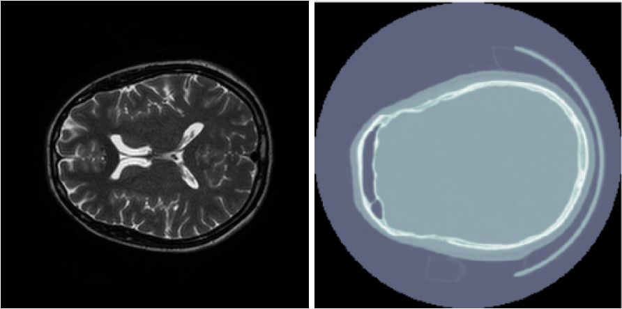

# CycleGAN
This repository contains code for training  a CycleGAN on T2 MRI images and CT scan. It was made in the context of the final project of the course *Deep Learning for Medical Imaging* in the MSc in AI at CentraleSupelec.

This was originally
<!--stackedit_data:
eyJoaXN0b3J5IjpbLTE5NzE3ODMwOTEsOTMwMjE0OTMxXX0=
-->